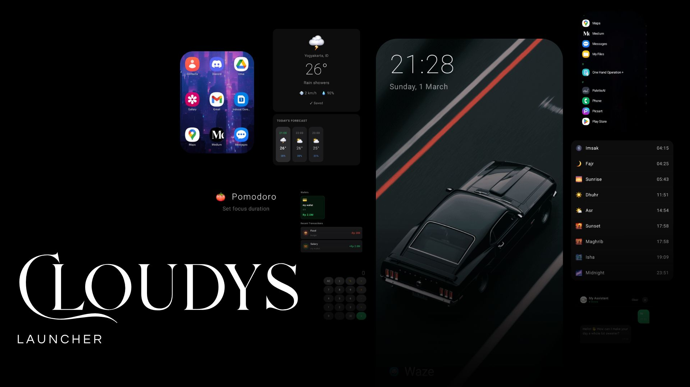

<div align="center">


# Cloudys Launcher

**A launcher that stays out of your way, until you need it.**

[](https://android.com)
[-3DDC84?style=flat-square&logo=android&logoColor=white)](https://developer.android.com)
[](LICENSE)
[](../../releases)
[](../../releases)

Your wallpaper shines through. Your apps load fast. Your phone feels like yours again.

</div>



---

## Why Cloudys?

Most launchers are either bloated or too bare to be useful. Cloudys sits in between: a clean home screen with a focused set of tools that show up when you need them and disappear when you don't.

- Transparent background so your wallpaper is the design
- App icons render with full alpha transparency, no white boxes
- Smooth animations throughout, lightweight on any device
- Every feature earns its place

---

## Features

### 🏠 Home Screen
Grid or list layout. Toggle app names, hide apps, and long press any icon for quick actions like pin, hide, or uninstall without leaving the home screen.

In grid mode, apps are organized into swipeable pages with a dot indicator. Columns (3 to 6) and rows (3 to 7) are fully adjustable from Settings and persist across restarts.

### 📌 Dock
Pin up to 4 favorite apps for one-tap access. Icons render with full transparency, same as the home screen.

### 🧩 Home Widgets
Three widgets live directly on the home screen: **Clock** (large time and date), **Date** (calendar card), and **Battery** (live charge bar that turns red when low and green while charging).

### 💬 Chat
A lightweight personal assistant that knows your name, greets you by time of day, and keeps the conversation going throughout the session.

### 🌤️ Weather
Real-time weather for any city. No account, no API key. Save up to 8 locations and check an hourly forecast for the rest of the day.

### 💱 Currency
Live exchange rates for 14 currencies: USD, EUR, IDR, GBP, JPY, CNY, SGD, AUD, KRW, MYR, THB, INR, SAR, and AED. Rates pull from Google Finance with automatic fallback to the fawazahmed0 exchange API.

### 📝 To-Do
A minimal task list. Check things off with an animated canvas checkmark. No accounts, no sync.

### ⏳ Countdown
Track birthdays, deadlines, and trips with color-coded cards so you always know how close you are.

### 🕌 Prayer Times
Full salah schedule for any city using the open [MuslimSalat](https://muslimsalat.com) API. The current prayer highlights automatically. Save up to 8 cities, no account required.

### 🍅 Pomodoro
A fullscreen focus timer. Set your own work duration, watch a circular arc count down, and keep the screen on automatically while you focus.

### 🧮 Calculator
Handles everyday arithmetic offline with a clean, tap-friendly layout.

### 📐 Unit Converter
Offline conversion across six categories: Length, Weight, Temperature, Speed, Volume, and Area.

### 💪 Habits
Add daily habits, tap to mark them done, and build streaks. The same smooth animated checkmark from the To-Do tool is used here for consistency. Progress shows up in the Dashboard at a glance.

### 💰 Money Manager
A full personal budget tracker built into the launcher. Create multiple wallets, each with its own emoji, color, and currency. Log income, expenses, and transfers across 15 transaction categories.

Four tabs: **Overview** (wallet carousel, spending by category, recent transactions), **History** (grouped by date, swipe to delete), **Analytics** (donut chart, income vs. expense, daily trend, top categories), and **Wallets** (create, view, and delete with live balances).

Supports 8 currencies. Includes JSON export and import for full local backup. No cloud, no accounts.

---

## ⚙️ Settings

Long press your avatar in the Dock to open Settings. Everything is adjustable:

- Layout mode (Grid or List)
- Grid size: columns and rows per page
- App name visibility
- Icon size for home screen and Dock independently
- Dark or Light theme
- Avatar photo (auto-cropped to a circle)
- Hidden apps
- Your name and assistant name

---

## ⚡ Performance

- Icons stored in a 3 MB LruCache with automatic eviction under memory pressure
- Drawables converted to Bitmap once at load time then released
- App list only reloads when the installed packages actually change
- DataStore flows for tools use `WhileSubscribed(5000)` and pause when the Dashboard closes
- `derivedStateOf` limits recomposition to only what changes
- R8 full mode strips unused code from the release APK

---

## 📦 Installation

Download the right APK from the [Releases](../../releases) page:

| APK | Device |
|---|---|
| `arm64-v8a.apk` | Most Android phones (2017 and newer), pick this if unsure |
| `armeabi-v7a.apk` | Older 32-bit Android phones |
| `x86_64.apk` | Emulators and ChromeOS |

1. Download the APK
2. Enable **Install from unknown sources** in Settings
3. Open the APK and tap Install
4. Set as your default launcher when prompted

---

## 📄 License

```
MIT License

Copyright (c) 2025 Satria Bagus

Permission is hereby granted, free of charge, to any person obtaining a copy
of this software and associated documentation files (the "Software"), to deal
in the Software without restriction, including without limitation the rights
to use, copy, modify, merge, publish, distribute, sublicense, and/or sell
copies of the Software, and to permit persons to whom the Software is
furnished to do so, subject to the following conditions:

The above copyright notice and this permission notice shall be included in all
copies or substantial portions of the Software.

THE SOFTWARE IS PROVIDED "AS IS", WITHOUT WARRANTY OF ANY KIND, EXPRESS OR
IMPLIED, INCLUDING BUT NOT LIMITED TO THE WARRANTIES OF MERCHANTABILITY,
FITNESS FOR A PARTICULAR PURPOSE AND NONINFRINGEMENT. IN NO EVENT SHALL THE
AUTHORS OR COPYRIGHT HOLDERS BE LIABLE FOR ANY CLAIM, DAMAGES OR OTHER
LIABILITY, WHETHER IN AN ACTION OF CONTRACT, TORT OR OTHERWISE, ARISING FROM,
OUT OF OR IN CONNECTION WITH THE SOFTWARE OR THE USE OR OTHER DEALINGS IN
THE SOFTWARE.
```

---

## 👤 Author

<div align="center">


**Satria Bagus**

[](https://github.com/01satria)

*Built with ❤️ in Indonesia*

</div>
